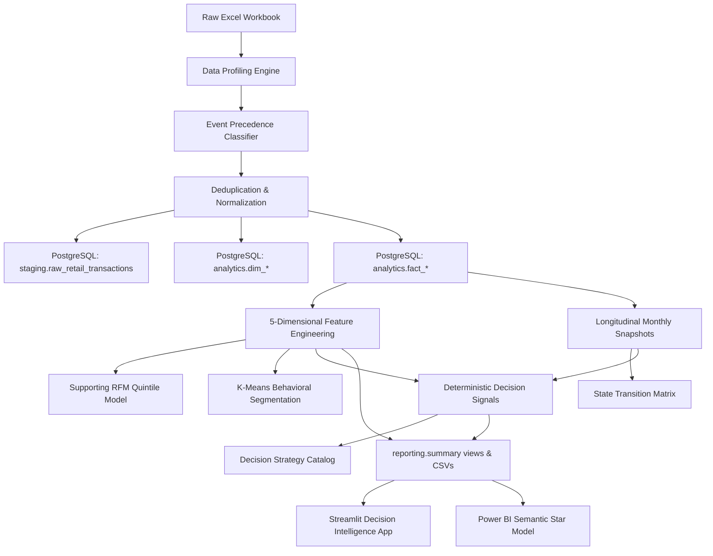

# System Architecture & Technical Specifications

## 1. High-Level System Architecture

---

## 2. PostgreSQL Storage Tier

- **Engine**: PostgreSQL 16.4 (Windows x64 embedded cluster on port `54329`).
- **Database**: `cbdil_analytics`.
- **Schemas**:
  - `staging`: Raw ingestion records retaining source sheet provenance and event classification tags.
  - `analytics`: Star schema dimensions (`dim_customer`, `dim_product`, `dim_date`, `dim_country`), fact tables (`fact_order`, `fact_transaction`), and analytical models (`customer_behavior_features`, `customer_segment`, `customer_monthly_snapshot`, `customer_decision_signal`).
  - `reporting`: Summary aggregates (`monthly_summary`, `segment_summary`, `customer_summary`, `decision_summary`, `data_control_summary`).

---

## 3. Technology Stack & Verification
- **Python**: 3.14.6 x64 (Isolated virtual environment `.venv/`).
- **Data Engineering**: `pandas` 3.0.6, `numpy` 2.5.3, `pyarrow` 25.0.1, `openpyxl` 3.1.5.
- **Machine Learning**: `scikit-learn` 1.9.1 (KMeans, StandardScaler, Silhouette metrics).
- **Relational ORM**: `sqlalchemy` 2.0.54, `psycopg` 3.3.6 (C-binary backend).
- **Interactive UI**: `streamlit` 1.64.0, `plotly` 7.1.0.
- **Quality Assurance**: `pytest` 9.1.1, `ruff` 0.16.8.
